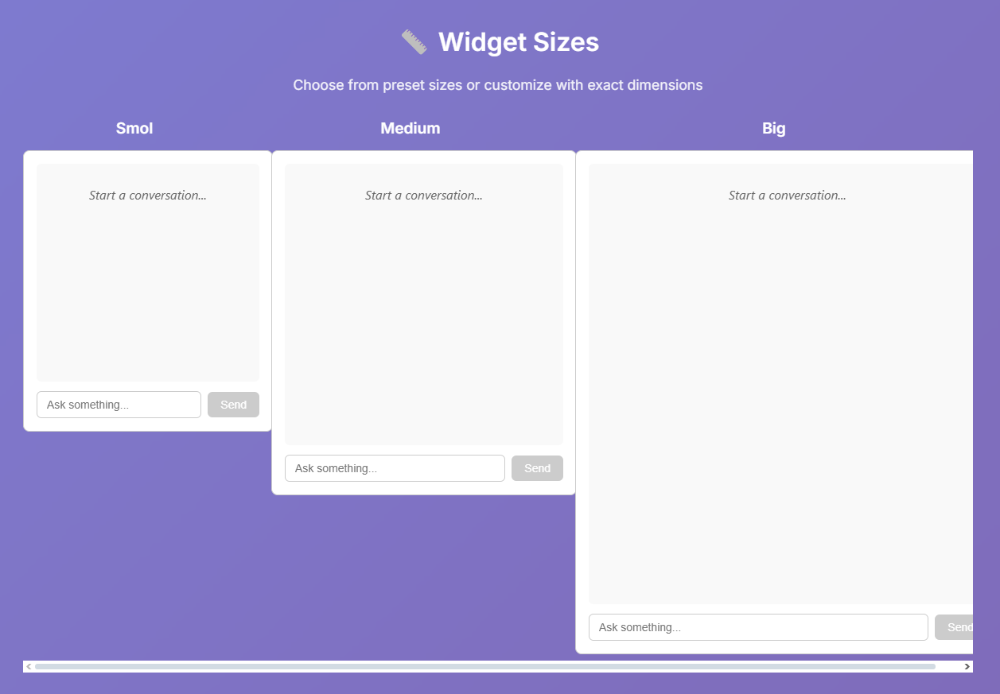
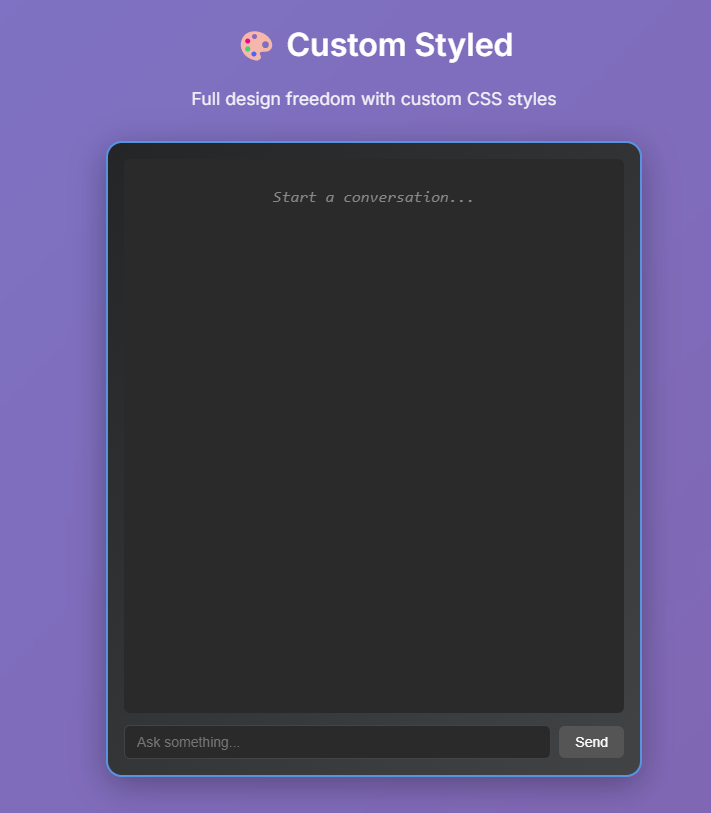
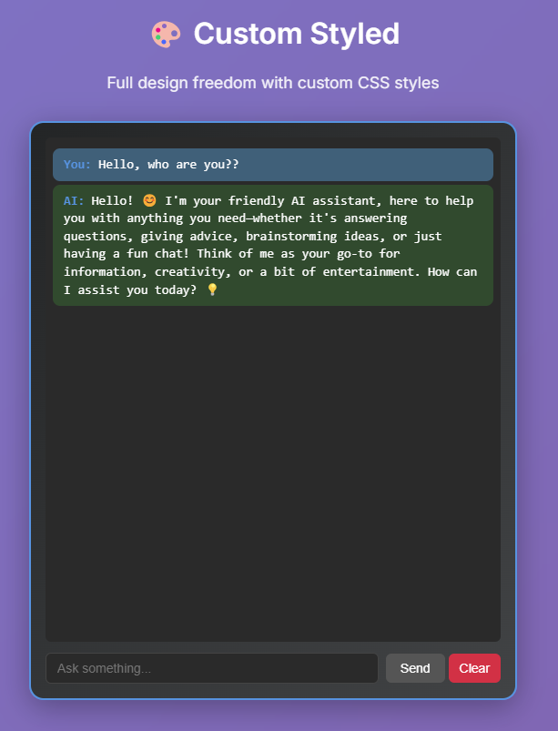
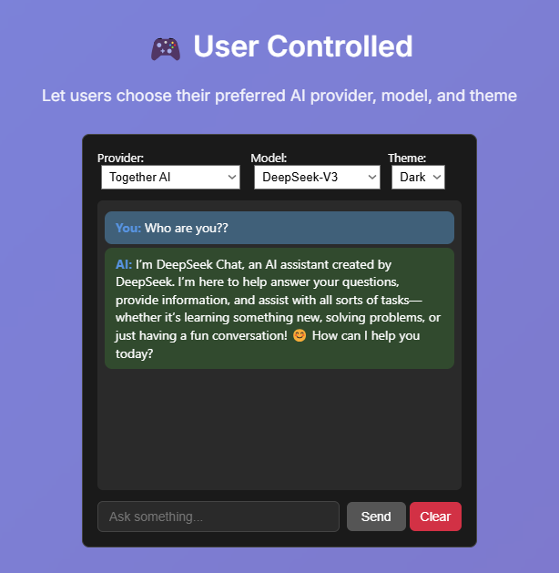
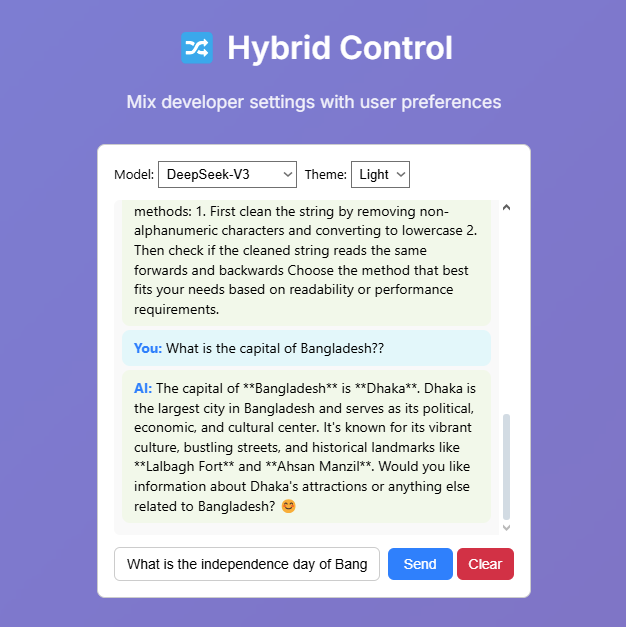
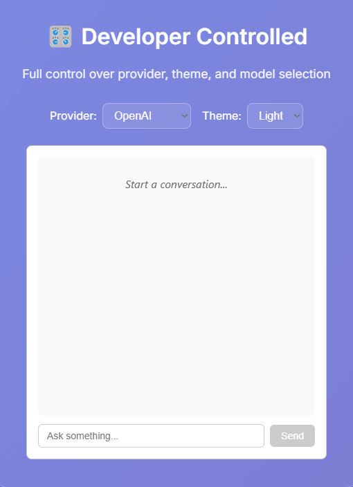

# TalkToClover

A modern, customizable React AI chat widget supporting OpenAI, Together AI, and more. Easily add a beautiful, accessible chat experience to your app or website.

<p align="center">
  
</p>

---

## 🚀 Installation

```bash
npm install talktoclover
```

---

## ✨ Features

- Light & dark themes
- Multiple AI providers (OpenAI, Together AI, Grok stub)
- Preset sizes (`smol`, `medium`, `big`) and full custom sizing
- User or developer control of provider, theme, and model
- Custom style prop for full design freedom
- Accessibility (ARIA, keyboard, responsive)
- Clear conversation, auto-scroll, and more

---

## 🛠️ Usage

### Basic Example

```jsx
import ChatWidget from 'talktoclover';

function App() {
  return (
    <ChatWidget
      apiKey="YOUR_API_KEY"
      provider="openai"
      model="gpt-3.5-turbo"
      systemPrompt="You are a helpful assistant."
    />
  );
}
```

<p align="center">
  
</p>
<p align="center">
  
</p>

---

---

## ⚙️ Props

| Prop           | Type                                   | Default      | Description |
|----------------|----------------------------------------|--------------|-------------|
| `apiKey`       | `string`                               | **required** | Your API key for the chosen provider |
| `provider`     | `'openai' \| 'together' \| 'grok'`    | `'openai'`   | AI provider to use |
| `model`        | `string`                               | `'gpt-3.5-turbo'` | Model for the provider |
| `systemPrompt` | `string`                               | `undefined`  | System prompt for the AI |
| `theme`        | `'light' \| 'dark'`                    | `'light'`    | Widget theme |
| `placeholder`  | `string`                               | `'Ask something...'` | Input placeholder |
| `size`         | `'smol' \| 'medium' \| 'big'`         | `'medium'`   | Preset widget size |
| `width`        | `number`                               | (from size)  | Custom width (overrides size) |
| `height`       | `number`                               | (from size)  | Custom height (overrides size) |
| `style`        | `React.CSSProperties`                  | `{}`         | Custom container style (overrides all) |
| `userControls` | `{ provider?: bool, theme?: bool, model?: bool }` | `{}` | Show dropdowns for user to pick provider/theme/model |

---

## 🎨 Customization


### Preset Sizes

<p align="center">
  
</p>

```jsx
<ChatWidget apiKey="..." size="smol" />
<ChatWidget apiKey="..." size="medium" />
<ChatWidget apiKey="..." size="big" />
```

### Custom Size
```jsx
<ChatWidget apiKey="..." width={600} height={700} />
```


### Custom Style

<p align="center">
  
</p>

```jsx
<ChatWidget
  apiKey="..."
  size="big"
  theme="dark"
  style={{
    boxShadow: "0 8px 32px rgba(0,0,0,0.3)",
    border: "2px solid #4a90e2",
    background: "linear-gradient(135deg, #232526 0%, #414345 100%)",
    color: "#fff",
    fontFamily: "Fira Mono, monospace",
    borderRadius: "16px",
  }}
/>
```


### User Controls (Let End-User Pick Provider/Theme/Model)

<p align="center">
  
</p>

```jsx
<ChatWidget
  apiKey="..."
  userControls={{ provider: true, theme: true, model: true }}
/>
```


### Hybrid (Some by Dev, Some by User)

<p align="center">
  
</p>

```jsx
<ChatWidget
  apiKey="..."
  provider="together"
  userControls={{ theme: true, model: true }}
  theme="dark"
  model="deepseek-ai/DeepSeek-V3"
/>
```

---

## 🧑‍💻 Advanced Usage


### All Together: Full Customization

<p align="center">
  
</p>

```jsx
<ChatWidget
  apiKey="..."
  provider="openai"
  model="gpt-4"
  systemPrompt="You are a helpful assistant."
  size="big"
  theme="dark"
  userControls={{ model: true }}
  style={{
    border: "2px dashed #00e676",
    background: "#222",
    color: "#fff"
  }}
/>

---

## 🤝 Contributing

1. Fork the repo
2. Create a feature branch
3. Make your changes
4. Add/adjust tests if needed
5. Submit a pull request

---


## 📝 License

Copyright (c) Arefin Amin. All rights reserved.

---

## 💬 Support
For issues and questions, open an issue on GitHub.

